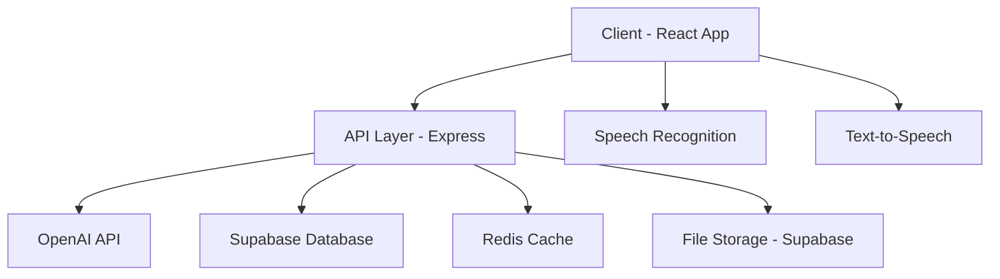

## Practc AI - AI-Powered Interview Practice Platform


Practc AI is an advanced AI-powered interview practice platform that conducts personalized interviews based on your resume and job description, providing comprehensive feedback to help you improve your interview skills.

## 🌟 Features

- **AI-Powered Interviews**: Dynamic interview questions based on your resume and target job
- **Voice Interaction**: Natural conversation with speech recognition and text-to-speech
- **Real-time Feedback**: Instant response analysis and suggestions
- **Comprehensive Assessment**: Detailed feedback on technical skills, communication, and overall performance
- **Progress Tracking**: Visual analytics of your interview performance
- **Interview Transcripts**: Downloadable interview reports with feedback

## 🏗️ Architecture



### System Components

1. **Frontend (React + Vite)**
   - React for UI components
   - TailwindCSS for styling
   - Context API for state management
   - Web Speech API for voice interactions

2. **Backend (Node.js + Express)**
   - RESTful API endpoints
   - File processing and storage
   - Interview session management
   - Caching layer

3. **Database (Supabase)**
   - PostgreSQL for data storage
   - Row Level Security for data protection
   - Real-time subscriptions
   - File storage for documents

4. **Caching (Redis)**
   - Session data caching
   - Rate limiting
   - Performance optimization

5. **AI Integration**
   - OpenAI GPT-4 for interview logic
   - Custom prompt engineering
   - Context-aware responses

## 🛠️ Tech Stack

- **Frontend**
  - React 18.3
  - TypeScript 5.5
  - Vite 5.4
  - TailwindCSS 3.4
  - Lucide React (icons)
  - Recharts 
  - React Router 6
  - Web Speech API

- **Backend**
  - Node.js 18.x
  - Express 4.18
  - OpenAI API
  - Multer (file handling)
  - PDF Parser
  - Mammoth (docx parsing)

- **Database & Storage**
  - Supabase
  - PostgreSQL
  - Redis

## 🚀 Getting Started

### Prerequisites

- Node.js 18.x or higher
- npm or yarn
- Supabase account
- OpenAI API key
- Redis (optional, falls back to in-memory cache)

### Environment Setup

1. Clone the repository
```bash
git clone https://github.com/skidi3/practc-ai.git
cd practc-ai
```

2. Install dependencies
```bash
# Frontend
npm install

# Backend
cd server
npm install
```

3. Configure environment variables

Frontend (.env):
```env
VITE_SUPABASE_URL=your-project.supabase.co
VITE_SUPABASE_ANON_KEY=your-anon-key
VITE_API_URL=http://localhost:3001
```

Backend (.env):
```env
PORT=3001
SUPABASE_URL=your-project.supabase.co
SUPABASE_KEY=your-service-role-key
OPENAI_API_KEY=sk-xxxx...xxxx
REDIS_URL=redis://localhost:6379
```

### Database Setup

1. Create a new Supabase project
2. Run the migrations from `supabase/migrations/`
3. Enable the required extensions

### Running the Application

1. Start the backend server:
```bash
cd server
npm run dev
```

2. Start the frontend development server:
```bash
npm run dev
```

## 📁 Project Structure

```
practc-ai/
├── src/
│   ├── components/      # Reusable UI components
│   ├── context/        # React Context providers
│   ├── hooks/          # Custom React hooks
│   ├── pages/          # Page components
│   ├── services/       # API and utility services
│   └── types/          # TypeScript definitions
├── server/
│   ├── controllers/    # Request handlers
│   ├── middleware/     # Express middleware
│   ├── services/       # Business logic
│   └── routes/         # API routes
└── supabase/
    └── migrations/     # Database migrations
```

## 🔒 Security Features

- Row Level Security (RLS) in Supabase
- Rate limiting
- Input validation
- Secure file handling

## 🎯 Future Enhancements

- [ ] Multi-language support
- [ ] Custom interview templates
- [ ] Interview recording
- [ ] Peer review system
- [ ] Integration with job platforms

## 🎥 Demo

[Watch Demo Video](TODO: record video)

## 🌐 Live Demo

[Try Practc AI](TODO: live-url)

## 📄 License

This project is licensed under the MIT License - see the [LICENSE](LICENSE) file for details.

## 🤝 Contributing

Contributions are welcome! Please feel free to submit a Pull Request.
